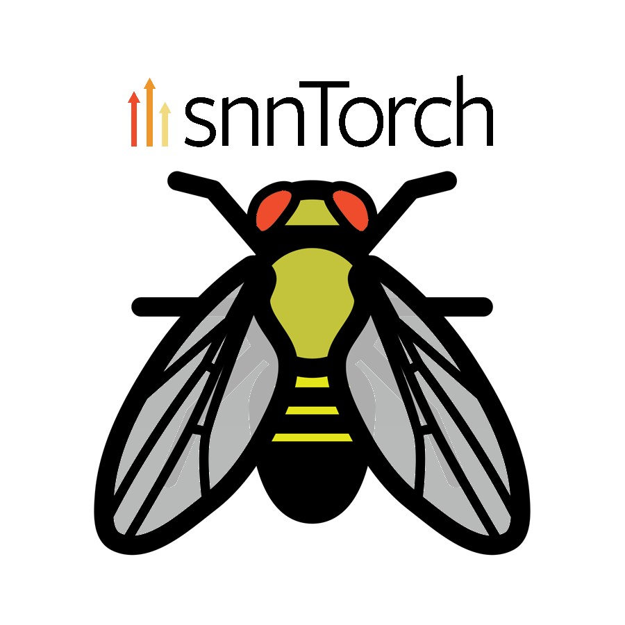

# Fly Brain snnTorch

<br>
<br>

<p align="center">
    
</p>

<br>

<p align="center">
Port of <a href="https://github.com/philshiu/Drosophila_brain_model">Brian2</a> implementation of fruit fly brain to snnTorch with new sensory experiments
</p>

<br>

## Sensory Experiments

Right now there are 4 experiments available for different types of fruit fly sensors:
1) taste (sugar)
2) olfactory (smell)
3) vision (optical)
4) auditory (sound)

<br>

There will be 5 more experiments added in the future:
1) humidity (water)
2) temperature (infrared)
3) pheromone (compound)
4) touch (pressure)
5) electrical fields

<br>

The variable `chosen_sensory_neurons` (line 175) in `fly_brain.py` allows you to change the stiumalted sensory neurons.

<br>

## Results

The produced charts for all experiments can be viewed in the `images` folder of this repository.

All experiments charts in the images folder were produced by using the dense version of the fruit fly brain model but its sparse version outputs almost identical results.

You can switch between the dense and sparse models by following my comments in the `fly_brain.py` file.

<br>

## Quickstart

You need conda to smoothly run this software but you can try to use it without conda or with python venv only.

You do not need CUDA or MPS to run this code but those features can be enabled (uncommented) below the line 36 in `fly_brain.py`.

First open new terminal at the downloaded `fly-brain-snntorch` repository folder. Then run following commands based on your OS:

<br>

### Linux

Create a conda environment first
```bash
conda create -n fly_brain python=3.10 
```

Enable the created conda environment
```bash
conda activate fly_brain
```

Install packages from pip
```bash
pip install -r requirements.txt
```

#### Run the simulation
```bash
python3 fly_brain.py
```

<br>

### Windows 11

Decide if you want to use Conda or Python venv.

#### Conda

If you picked Python venv skip this whole section.

Create a conda environment first
```bash
conda create -n fly_brain python=3.10
```

Enable the created conda environment
```bash
conda activate fly_brain
```

Install packages from pip
```bash
pip install -r requirements.txt
```

#### Run the simulation
```bash
python .\fly_brain.py
```

&nbsp;
#### Python venv

If you picked Conda skip this whole section.

Create venv environment first
```bash
python3 -m venv .venv
```

Activate the created venv environment
```bash
source .venv/bin/activate
which python
```

Prepare pip for venv
```bash
python3 -m pip install --upgrade pip
python3 -m pip --version
```

Install packages from pip
```bash
pip install -r requirements.txt
```

#### Run the simulation
```bash
python .\fly_brain.py
```

<br>

### macOS

Create a conda environment first
```bash
conda create -n fly_brain python=3.9.25
```

Enable the created conda environment
```bash
conda activate fly_brain
```

Install packages from pip
```bash
pip install -r requirements.txt
```

#### Run the simulation
```bash
python3 fly_brain.py
```

<br>

## Requirements

* Python >= 3.9.25
* PyTorch >= 2.8.0
* snnTorch >= 0.9.4
* NumPy >= 2.0.2
* Matplotlib >= 3.9.4
* Pandas >= 2.3.3
* Fastparquet >= 2024.11.0

<br>

## Tested Systems

1) OS Ubuntu 24, CPU Intel i5-8300H, GPU Nvidia GeForce GTX 1050 Ti Max-Q, 64 GB RAM
2) OS macOS 15, CPU M2 Max, 64 GB RAM
3) OS Windows 11, CPU Intel i5-8365U, 16 GB RAM

<br>

The snnTorch sugar experiment with 1000 timesteps ran the fastest on the tested macOS system and slowest on the Windows 11 system. The difference between those systems in speed of simulation was just 4 seconds. 

It is quite possible that this snnTorch port will also work on 4 GB - 8 GB systems with weaker CPUs.

<br>

## CSR Issues

PyTorch .to_sparse_csr() is still in beta in PyTorch 2.8.0 so remove this method if the code won't work at all with it and run the network with COO weights only.

At the moment sparse CSR was succesfully tested on all the "Tested Systems" mentioned above. Add an Issue to [PyTorch](https://github.com/pytorch/pytorch) not here if it does not work on your hardware.

<br>

## Brian2 Comparison

Brian2 drosophila_brain_model sugarR experiment ran for 90 seconds on Apple M2 Max without available Cython. The same sugarR experiment with `force_overwrite=True` on Google Colab ran for 968 seconds (exactly 16 minutes in my test but it was 20 minutes when paper authors ran it: https://github.com/philshiu/Drosophila_brain_model/blob/main/example.ipynb). 

Inputs to sugar sensing neurons in Brian2 were given in 30 trials 1 second each with dt of 0.1 seconds resulting in 300 runs of inputs that is 3 times smaller than in sugar experiment implemented in this repository with 1000 runs of inputs. Adjusted, the fastest Brian2 version would take 270 seconds for 1000 runs (it takes 4 seconds in snnTorch) and 60 minutes in Google Colab.

This shows that **CPU implementation of snnTorch LIF neuron with use of sparse tensors speeds up the fruit fly brain simulation 68 times** on M2 Max compared to the fastest pure Python Brian2 CPU implementation. CUDA versions of both implementations were not compared.

This snnTorch implementation might also be used with [NIR](https://github.com/neuromorphs/NIR) to move this fruit fly brain model to other neuromorphic platforms in the future. This easy platform portability would not be possible in Brian2 except for only three existing options: Brian2CUDA, Brian2GeNN and Brian2Loihi. 

Brian2 does not output PTH files so in this framework it is much more difficult to share and compare differently trained weights of SNN models when it comes to MLOps.

<br>

### Disadvantage of snnTorch

All standard snnTorch neurons: Leaky, RLeaky, Synaptic, RSynaptic, Lapicque, Alpha, LeakyParallel, SLSTM, SConv2dLSTM operate without a relative refractory period, which could be important when simulating the real biological hyperpolarization behavior of the fruit fly brain with neurons that enter a period of enforced silence. This behavior is properly implemented in the Hodgkin-Huxley neuron model that is not used in snnTorch.

This issue however could be solved by implementing RPLIF: https://dl.acm.org/doi/10.1145/3746027.3755030 <br>or HDRP‑SNN: https://arxiv.org/pdf/2507.02960

Below is a 4K raster plot of spikes in 127000 neurons produced by the sugar experiment in this snnTorch port. It has to be compared to the raster plot of spikes in the Brian2 version that outputs DataFrame only.

<br>
<br>

<p align="center">
    
</p>

<br>
<br>

## Newer Brain Connectome

You can run the experiments with 783 version of the connectome by using CSV and PARQUET files from here: https://github.com/philshiu/Drosophila_brain_model

In the future you can also try to implement in snnTorch the [full nervous system](https://hms.harvard.edu/news/researchers-publish-first-complete-connectome-fruit-fly-brain-spinal-cord) of a fruit fly.

<br>


## Data Sources

CSV and Parquet files on MIT license (used inside my Python code) from: https://github.com/philshiu/Drosophila_brain_model

Mi1 neurons list on MIT license (used inside my Python code) from: https://github.com/hsseung/OpticLobe.jl/tree/main

Annotated murthylab neurons list on Apache 2.0 license (not used inside my Python code) from: https://github.com/murthylab/visual-system-parts-list/blob/main/data/neuron_table.csv

<br>

All data in this repository was stored in other repositories under the MIT license. This repository does not use the whole FlyWire data that is shared on the CC BY-NC 4.0, which would violate the commercial MIT license.

<br>

## Acknowledgements

This entire port to snnTorch in its final optimized and enhanced form was only possible because of the existence of earlier studies listed below:

1) P. K. Shiu, G. R. Sterne, N. Spiller et al. [“A drosophila computational brain model reveals sensorimotor processing”](https://doi.org/10.1038/s41586-024-07763-9) Nature, vol. 634, no. 8032, pp. 210–219, 2024.
2) F. Wang, B. H. Theilman, F. Rothganger et al. [“Neuromorphic Simulation of Drosophila Melanogaster Brain Connectome on Loihi 2”](https://doi.org/10.48550/arXiv.2508.16792) arXiv, 2025.
3) P. Schlegel, Y. Yin, A. S. Bates et al. [“Whole-brain annotation and multi-connectome cell typing of Drosophila”](https://doi.org/10.1038/s41586-024-07686-5) Nature, vol. 634, pp. 139–152, 2024. 
4) A. Matsliah, Sc. Yu, K. Kruk et al. [“Neuronal parts list and wiring diagram for a visual system”](https://doi.org/10.1038/s41586-024-07981-1) Nature, vol. 634, pp. 166–180, 2024.
5) J. K. Eshraghian, M. Ward, E. O. Neftci et al. [“Training Spiking Neural Networks Using Lessons From Deep Learning”](https://doi.org/10.1109/JPROC.2023.3308088) Proceedings of the IEEE, vol. 111, no. 9, pp. 1016-1054, 2023.

<br>

None of the aforementioned authors were aware of the creation of this port before its release to the public.

<br>

## No Warranty

The software is provided "as is" with no guarantees of performance, safety, or fitness for a purpose.

